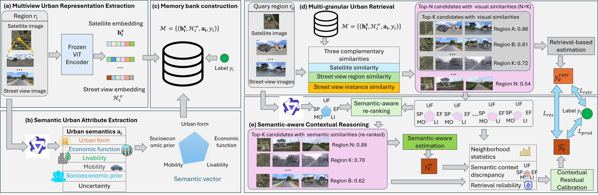

# This is the repo for UrbanMIL: Urban Multimodal In-Context Learning: Multi-Granular Retrieval and Contextual Reasoning for Urban Indicator Prediction

## Introduction
UrbanMIL is a retrieval-based framework that performs urban indicator prediction through multi-granular retrieval and contextual reasoning. Each urban region is represented by satellite and street view imagery, capturing complementary macro-scale urban morphology and micro-scale ground-level semantics. We introduce a semantic-aware retrieval mechanism that jointly exploits aerial morphology, ground-level urban environments, instance-level cross-view correspondences, and multimodal large language model (MLLM)-derived urban semantic attributes to retrieve semantically related urban regions across multiple granularities. We further design a contextual reasoning module that refines retrieval-based estimation by modeling latent semantic discrepancies, functional relationships, and contextual uncertainty within retrieved urban neighborhoods.

## Framewore


This folder contains a cleaned subset of the UrbanMIL codebase for anonymous submission.

## Directory Structure

- `UrbanMIL-requirements.txt`: environment requirements.
- `extract_embed_more_ind.py`: extracts ViT embeddings for satellite and street view images.
- `extract_semantics_qwen_structured_all_indicator_parallel.py`: extract urban semantic attributes for regions.
- `train_ind_semretr_reasoning_mech_full.py`: model training and predict socioeconomic indicators.


## The CityLens data can be downloaded from https://github.com/tsinghua-fib-lab/CityLens.

## Example command:

```powershell
python extract_embed_more_ind.py --json_path ../dataset/UrbanSensing_data/all_global_pop_task.json --indicator pop
```

```powershell
python extract_semantics_qwen_structured_all_indicator_parallel.py \
  --json_path ../dataset/UrbanSensing_data/all_global_pop_task.json \
  --out_json ../outputs/region_semantic_structured_pop_qwen.json \
  --base_img ../dataset/Citylens_images \
  --model_name Qwen/Qwen3-VL-8B-Instruct \
  --gpus 0,1 \
  --max_new_tokens 512 \
  --flush_every 10 \
  --resume
```

```powershell
python train_ind_semretr_reasoning_mech_full.py   --indicator gdp   --feature_pt ../outputs/region_features_gdp.pt   --semantic_pt ../outputs/region_semantic_emb_gdp_qwen_v2.pt \
--mechanism_json ../outputs/region_semantic_structured_gdp_qwen_repaired.json   --reason_arch retr_residual   --selection_metric r2   --target_transform raw   --reg_loss huber   --n_bins 10   --seed 41 \
--use_sims sat,stv,inst   --run_all_ablations   --ablation_mode no_sem   --topk 10
```

